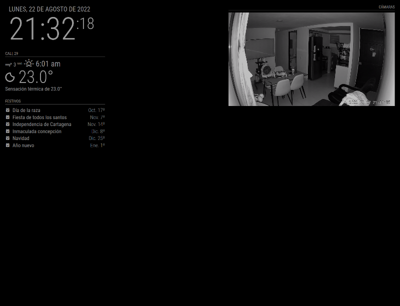

# MMM-rtsp-simple-server

This is a module for the [MagicMirror²](https://github.com/MichMich/MagicMirror/).

This module serve [RTSPSimpleServer](https://github.com/aler9/rtsp-simple-server) instance and proxy multiple RTSP feeds to be inserted in MagicMirror through [Video.js](https://github.com/videojs/video.js) and [videojs-http-streaming (VHS)](https://github.com/videojs/http-streaming) to be used even within browsers not supporting video tags.

## Example



## Using the module

To use this module, add the following configuration block to the modules array in the `config/config.js` file:
```js
var config = {
    modules: [
        {
            module: 'MMM-rtsp-simple-server',
            config: {
                updateInterval: 30000, // Default time to show next camera (in milliseconds)
                retryDelay: 5000, // Time to wait to refresh DOM when server and feeds are alive (in milliseconds)
                controls: false, // If video player should show its controls
                height: 350, // video player height
                width: 700, // video player width
                animationSpeed: 400, // Animation speed to update DOM
                sources: [], // sources list (rtsp urls to proxy. e.g rtsp://x.x.x.x:8554/live)
            }
        }
    ]
}
```

## Configuration options

| Option           | Default | Description                                                                              |
|------------------|---------|------------------------------------------------------------------------------------------|
| `updateInterval` | `30000` | *Optional* Default time to show next camera (in milliseconds)                            |
| `retryDelay`     | `5000`  | *Optional* Time to wait to refresh DOM when server and feeds are alive (in milliseconds) |
| `controls`       | `false` | *Optional* If video player should show its controls                                      |
| `height`         | `350`   | *Optional* video player height                                                           |
| `width`          | `700`   | *Optional* video player width                                                            |
| `animationSpeed` | `400`   | *Optional* Animation speed to update DOM                                                 |
| `sources`        | `[]`    | *Required* sources list (rtsp urls to proxy. e.g rtsp://x.x.x.x:8554/live)               |
